# 🚀 Week 2 Task – AWS Infrastructure Deployment

## 📖 Project Overview

This project demonstrates the deployment of a complete AWS infrastructure environment using core AWS services.

The objective of this task was to understand AWS networking fundamentals and deploy interconnected services in a structured, practical, and production-like manner.

---

## 🧩 Infrastructure Components

The deployment includes:

- Custom VPC
- Public Subnet
- Internet Gateway
- Route Table Configuration
- EC2 Instance (Amazon Linux)
- Amazon S3 (Static Website Hosting)
- VPC Endpoint (Gateway – S3)
- Amazon SQS (Visibility Timeout: 90 seconds)

---

## 🏗️ Architecture Workflow

The deployment followed this logical flow:

**Network Setup → Compute Deployment → Storage Setup → Private Connectivity → Messaging Service → Static Website Hosting**

---

# 📸 Step-by-Step Implementation

---

## 🥇 1️⃣ VPC Created

A custom Virtual Private Cloud (VPC) was created with CIDR block:

`10.0.0.0/16`

DNS resolution and DNS hostnames were enabled to allow internal communication within the VPC.

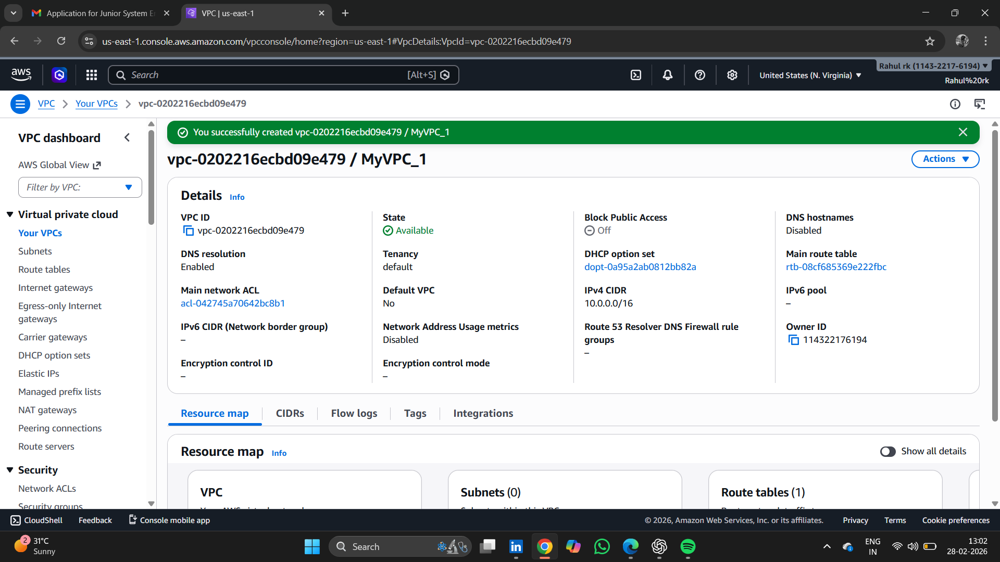

---

## 🥈 2️⃣ Public Subnet Created

A public subnet was created inside the VPC with CIDR block:

`10.0.1.0/24`

Auto-assign public IPv4 was enabled to allow instances to receive public IP addresses automatically.

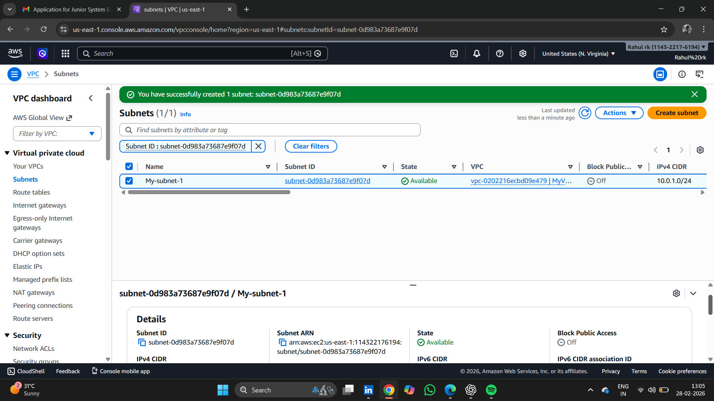

---

## 🥉 3️⃣ Internet Gateway Attached

An Internet Gateway (IGW) was created and attached to the VPC to enable outbound internet connectivity.

Without the IGW, resources inside the VPC cannot access external networks.

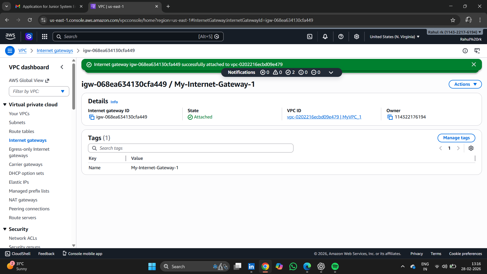

---

## 4️⃣ Route Table Configured

The route table associated with the subnet was updated with:

- `10.0.0.0/16 → local`
- `0.0.0.0/0 → Internet Gateway`

This ensures that internet-bound traffic is routed correctly.

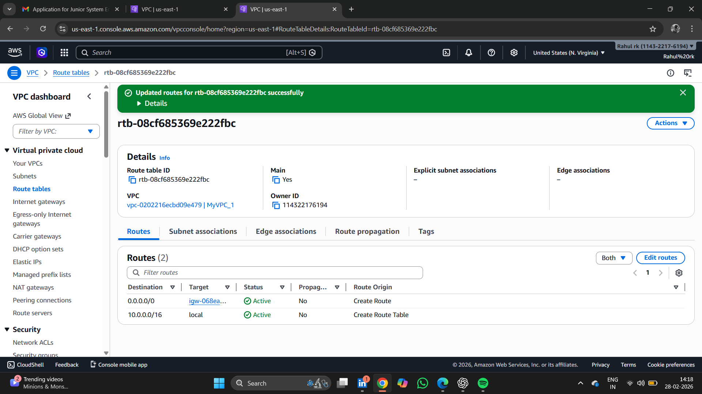

---

## 5️⃣ EC2 Instance Launched

An EC2 instance (Amazon Linux, t2.micro) was launched inside the public subnet.

Security group rules allowed:
- SSH (Port 22)
- HTTP (Port 80)

A public IPv4 address was assigned for external access.

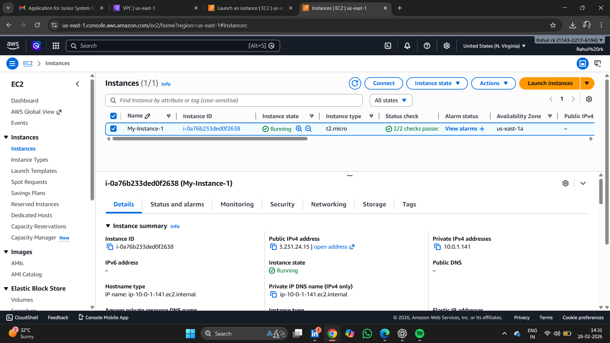

---

## 6️⃣ Internet Connectivity Verified

Internet connectivity was verified by connecting to the EC2 instance and running:

```bash
ping google.com
```

Successful responses confirmed correct VPC networking configuration.

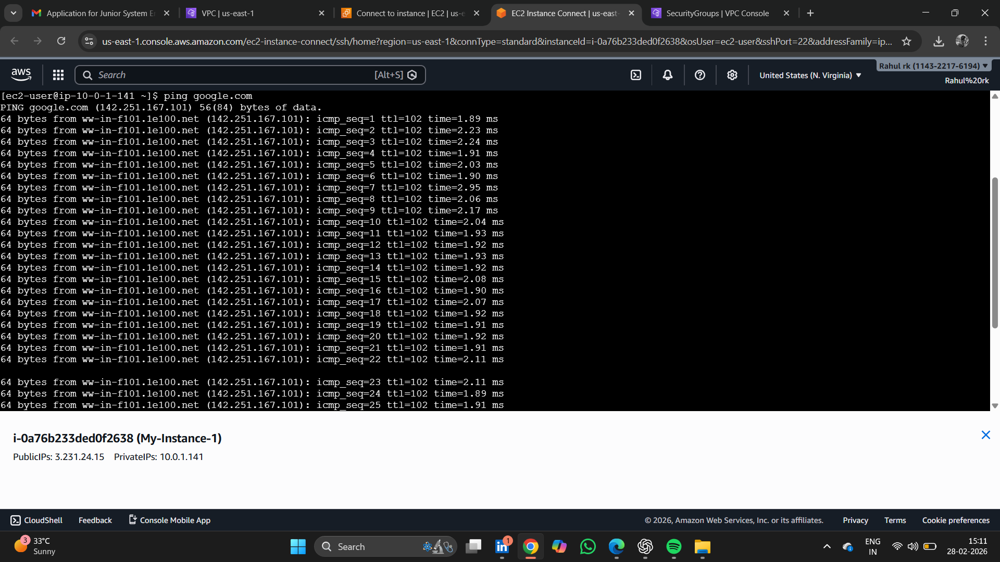

---

## 7️⃣ S3 Bucket Created

An Amazon S3 bucket was created in the same AWS region to host a static website.

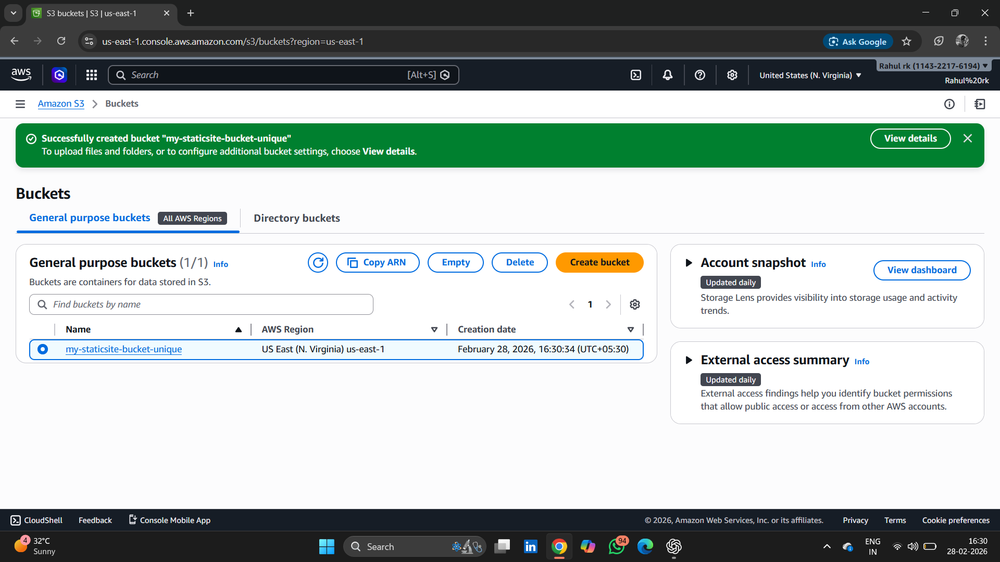

---

## 8️⃣ Files Uploaded to S3

The following files were uploaded:

- `index.html`
- `sample.txt`

Static website hosting was enabled in the bucket properties.

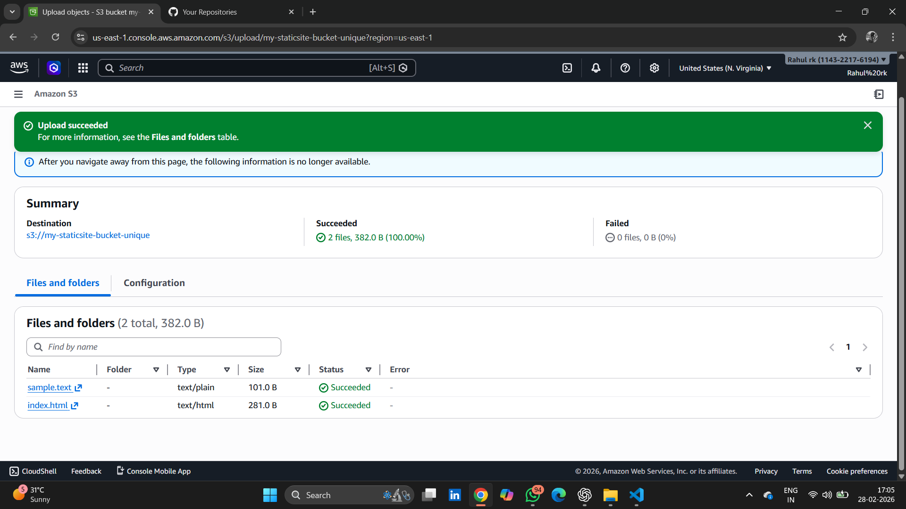

---

## 9️⃣ VPC Endpoint Created (Gateway Type – S3)

A Gateway-type VPC Endpoint for Amazon S3 was created and associated with the route table.

This enables private communication between the VPC and S3 without traversing the public internet.

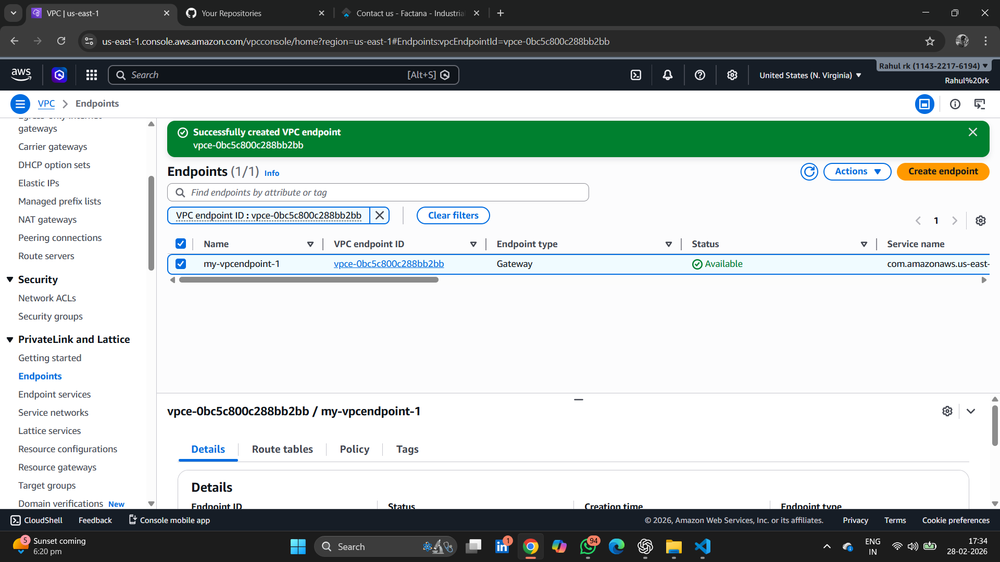

---

## 🔟 SQS Queue Created

An Amazon SQS Standard Queue was created with:

**Visibility Timeout: 90 seconds**

Test messages were successfully sent and received to validate functionality.

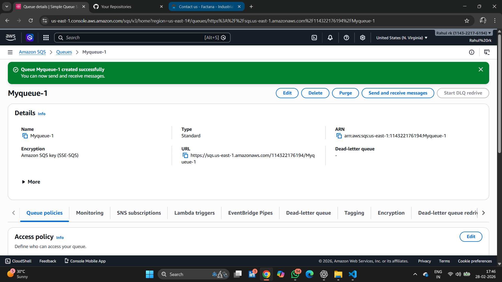

---

## 1️⃣1️⃣ S3 Bucket Policy Configured

A bucket policy was added to allow public read access to objects:

```json
{
  "Effect": "Allow",
  "Principal": "*",
  "Action": "s3:GetObject",
  "Resource": "arn:aws:s3:::bucket-name/*"
}
```

This configuration enabled static website hosting.

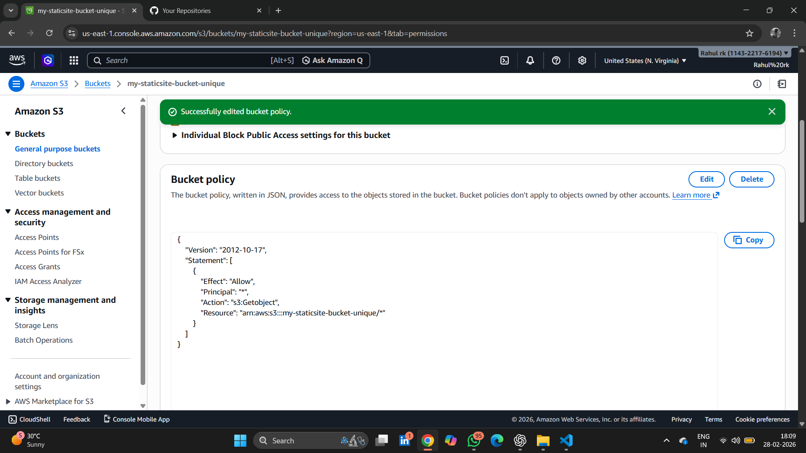

---

## 1️⃣2️⃣ Static Website Successfully Hosted

The static website was accessed using the S3 website endpoint URL.

This confirms:
- Correct bucket configuration
- Proper policy setup
- Successful file upload
- Public accessibility

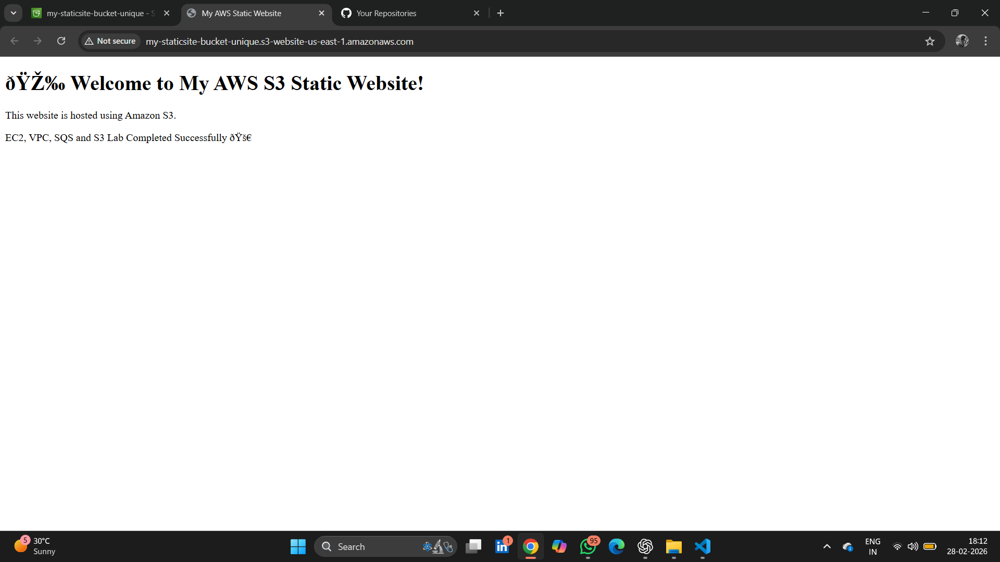

---

# 🧪 Validation & Testing

✔ EC2 successfully connected to the internet  
✔ Static website hosted and accessible  
✔ SQS queue tested successfully  
✔ VPC endpoint created and available  
✔ Networking components configured correctly  

---

# 🛠️ AWS Services Used

| Service | Purpose |
|----------|----------|
| Amazon VPC | Custom network creation |
| Subnet | Resource segmentation |
| Internet Gateway | Internet access |
| Route Table | Traffic routing |
| Amazon EC2 | Compute service |
| Amazon S3 | Object storage & website hosting |
| Amazon SQS | Message queuing |
| VPC Endpoint | Private S3 connectivity |

---

# 🎯 Key Learning Outcomes

- Designed and configured AWS networking architecture
- Implemented public subnet with internet access
- Deployed and secured EC2 instance
- Hosted a static website using Amazon S3
- Implemented messaging using Amazon SQS
- Configured VPC endpoint for private S3 communication
- Managed bucket policies and security configurations

---

